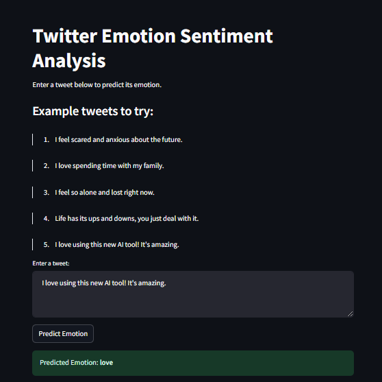

# Emotion Project

Welcome to the **Emotion** project! This repository contains tools and resources for analyzing and processing emotional data.


## Features

- Emotion detection and analysis.
- Pre-trained models for emotion classification.
- Easy-to-use APIs for integration.

## Installation
1. Clone the repository:
    ```bash
    git clone https://github.com/Gouravlohar/emotion_c
    ```
2. Navigate to the project directory:
    ```bash
    cd emotion_c
    ```
3. Install the required dependencies:
    ```bash
    pip install -r requirements.txt
    ```
